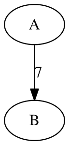

# Assignment 5: Six Degrees of Awesome

- **Out on:** October 17, 2018
- **Due by:** October 26, 2018 before 10:00 pm
- **Collaboration:** None
- **Grading:**
  - Packaging 10%,
  - Style 10% (where applicable),
  - Testing 10% (where applicable),
  - Performance 10% (where applicable),
  - Functionality 60% (where applicable)

## Overview

The fifth assignment is all about graphs, specifically about graphs of
movies and the actors and actresses who star in them.
You'll implement a graph data structure following the interface we
designed in lecture, and you'll implement it using the **incidence list**
representation.

Turns out that this representation is **way** more memory-efficient for
**sparse** graphs, something we'll need below.
You'll then use your graph implementation to help you play a variant of the
famous
[Six Degrees of Kevin Bacon](http://en.wikipedia.org/wiki/Six_Degrees_of_Kevin_Bacon)
game. Which variant? See below!

## Problem 1: Graph Implementation (70%)

Your first task for this assignment is to develop an "efficient"
implementation of the `Graph<V, E>` interface for directed graphs.
You'll follow the basic design for a **linked** representation in
the form of **incidence lists** that we outlined in lecture.
Your class implementing the `Graph<V, E>` interface should be called
`SparseGraph<V, E>`.

We put "efficient" in quotes above because while the **ideal** is
that all graph operations take O(1) time, the **reality** is that
at least **some** operations will take more.
For example, when inserting an edge you need to check for **duplicate
edges** which will take O(d) where d is the indegree / outdegree of
the vertices in question.
Similarly, when removing an edge, you need to **find** the edge you're
removing in the incoming / outgoing edge lists of the vertices in
question, again something that will take O(d) time.
Finally, depending on what you use internally to represent the various
lists, you may have to make **copies** as part of operations like
`vertices` or `outgoing` as discussed in lecture (and in a big comment
in `Graph.java` as well).
We will eventually see an implementation of `Graph<V, E>` that gets
O(1) **expected** time for at least the first two, but that's a few
lectures down the road.

As part of your `SparseGraph<V, E>` implementation, you will need **two**
private nested **or** inner classes, one to represent vertices, the
other to represent edges.
Sadly some things are easier with nested classes, other things are
easier with inner classes. Have fun figuring out which way to go!
(However, under **no** circumstances should you make **one** a nested
class and the **other** an inner class, that would just be funny.)

**Be prepared for some serious pain as you navigate the weird world of
nested/inner classes with several type parameters!**
In particular the `convert` methods are bound to drive you insane as,
for example, casting from a `Vertex<V>` interface to your private
class will most likely lead to an "unchecked cast" warning.
**As a special exemption from the usual rule regarding warnings, you're
allowed to have *two* of these "unchecked cast" warnings for free on
this problem!**
Not because we like them, but because the way to make them disappear
(short of using `@SuppressWarnings` which you're not allowed to use)
is shrouded in deep mystery.

Note that you are allowed (in principle anyway) to use the Java
collection classes `java.util.List`, `java.util.ArrayList`, and
`java.util.LinkedList`.
However, as discussed in lecture, using these will cause iterator
complications that you'll have to deal with.
(See also the long comment regarding iterators in the `Graph<V, E>`
interface.)

### Testing

Your `SparseGraph<V, E>` class should come with a full suite of
JUnit 4 test cases in a file `SparseGraphTest.java`.
Be sure to test **all** public methods and be sure to test **all**
exceptions for error situations as well.

### Printing Graphs

Finally, your `SparseGraph<V, E>` class has to implement a special
`toString()` method as well.
For a simple `Graph<String, Integer>` into which the vertices `A` and
`B` as well as an edge `7` from `A` to `B` have been inserted, the
string returned by `toString()` should have the following format:

```
digraph {
  "A";
  "B";
  "A" -> "B" [label="7"];
}
```

Note that it is **very** important that you follow this format
**exactly** as given, curly braces and quote marks and all.
Also, notice that all the vertices are output first, then all the
edges.
If you want you can stop reading this problem now; but if you are
curious why we picked this format, read on.

### Drawing Graphs with GraphViz

The strange format for "printing" the graph is useful because
various tools in the
[GraphViz](http://www.graphviz.org/)
package can be used to turn those strings into "actual" graphs:



This particular image was made by running the command
```
$ dot -Tpng graph.dot >graph.png
```
with `graph.dot` containing the string shown above.
Note that you're **not** required to do anything in particular
with [GraphViz](http://www.graphviz.org/) for this problem, just
follow the format as described and you'll be fine.
(But again, if you're curious to try, you can install `graphviz`
easily in Ubuntu using the Synaptic Package Manager. See here
for other platforms: [https://graphviz.gitlab.io/download/](https://graphviz.gitlab.io/download/)

## Problem 2: Six Degrees of Angelina Jolie (30%)

Your second task for this assignment is to write a program that
will help you play the
[Six Degrees of Kevin Bacon](http://en.wikipedia.org/wiki/Six_Degrees_of_Kevin_Bacon)
game.
This game is played on a graph of movies and actors and actresses
who starred in them.
You can read all about the original game at the link above, but
we'll be playing a variant called "Six Degrees of Angelina Jolie"
instead. It's only fair.

The **Jolie Number** is defined as follows:
[Angelina Jolie](https://en.wikipedia.org/wiki/Angelina_Jolie) has a
Jolie Number of 0;
people who co-starred in a movie with Angelina Jolie have a Jolie
Number of 1;
people who co-starred in a movie with someone who has a Jolie Number
of 1 in turn have a Jolie Number of 2;
and so on.

Given any actor or actress, the goal of the game is to establish
their Jolie Number by a sequence of movies and co-stars.
For example, using the "action" data set posted on Piazza, we can
show that
[Peter Sellers](http://en.wikipedia.org/wiki/Peter_Sellers)
has a Jolie Number of 2 as follows:

```
Sellers, Peter
Casino Royale (1967)
Bisset, Jacqueline
Mr. & Mrs. Smith (2005)
Jolie, Angelina
```

Angelina Jolie (0) starred in "Mr. & Mrs. Smith" with Jacqueline
Bisset (1) who starred in "Casino Royale" with Peter Sellers (2).
Or let's try
[Meryl Streep](https://en.wikipedia.org/wiki/Meryl_Streep)
instead:

```
Streep, Meryl
River Wild, The (1994)
Bratt, Benjamin (I)
Great Raid, The (2005)
Macintosh, Laird
Alexander (2004)
Jolie, Angelina
```

Angelina Jolie (0) starred in "Alexander" with Laird Macintosh (1)
who starred in "The Great Raid" with Benjamin Bratt (2) who starred
in "The River Wild" with Meryl Streep (3). Interestingly this works
**way** into the past as well:

```
De Rosselli, Rex
Elmo, the Mighty (1919)
Lincoln, Elmo
Story of Dr. Wassell, The (1944)
Roosevelt, Franklin Delano
Great Raid, The (2005)
Macintosh, Laird
Alexander (2004)
Jolie, Angelina
```

Turns out that
[Rex De Roselli](http://en.wikipedia.org/wiki/Rex_De_Rosselli)
**died in 1941** and yet he has a Jolie Number of just 4!
Actually Rex **really** has a Jolie Number of 3 but we need
to use a much bigger data set to show this:

```
De Rosselli, Rex
Lazy Lightning (1926)
Gaynor, Janet (I)
Century of Cinema, A (1994)
Hopkins, Anthony
Alexander (2004)
Jolie, Angelina
```

We have posted two data sets suitable for the program on Piazza
(the data sets are courtesy of
[Robert Sedgewick](http://introcs.cs.princeton.edu/java/45graph/)):

- `action06.txt.gz` (4.4 MB uncompressed, only action movies)
- `all06.txt.gz` (58 MB uncompressed, all movies from the 2006 IMDB)

The databases are compressed using `gzip`. You can decompress them using
the UNIX command `gunzip`.
The format of these data sets is rather simple: Each line is a movie,
and each movie consists of several fields separated by the "/" character.
The first field is the name of the movie itself, all the following fields
are the names of actors and actresses starring in the movie.
Reading this data is not complicated (although we did have to clean up
the data sets to work around Java's weird issues with UTF-8 files), but
we hand you the parsing code anyway so you can focus on the search
algorithm instead.

In order to find the smallest Jolie Number for an actor we proceed
as follows:
First we identify the vertices for both Angelina Jolie and the actor
in question (we already give you that code).
Then we start a **breadth-first search** at the vertex for Angelina;
as we do this we keep track of the "previous vertex" that got us to
the one we're currently investigating.
Once we find the vertex for the other actor, we are done: We just
have to print out the path that got us here.
**This implementation of BFS is the only thing you have to write for
this problem!**
Please put your code into the `Angelina.java` file we posted on Piazza
for you.
Make sure that the user can run it as follows from the command line:

```
$ java Angelina action06.txt "Oldman, Gary"
Oldman, Gary
Batman Begins (2005)
Bedella, David
Alexander (2004)
Jolie, Angelina
```

In other words, the first argument to the program is the database
to read and the second argument to the program is the actor for whom
we want to determine the Jolie Number.
You don't have to worry too much about error handling for this problem,
as long as **correct** command line invocations (a database file that's
actually present and has the correct format) work you'll be fine.
As before you still shouldn't throw exceptions. If there is no
path from the specified actor/actress to Angelina, you should
print `No solution found` and exit.

**As a special exemption from the usual rule regarding warnings, you're
allowed to have *one* "unchecked cast" warning on this problem!**

### Hint:

My strong advice is to start very small, even if that means creating a tiny graph with 4 or 5 actors and 2 or 3 movies. Then gradually work up to the larger ones as you become more sure things are working well. Then and only then should you try the full dataset. Note you may need to increase the RAM available to the virtual machine a bit - you can do this on the "System" tab of the Lubuntu Settings within the VirtualBox app


## Deliverables

Go to the assignment 5 page for Gradescope and click submit. Note that you can resubmit any time up until the deadline. You will be prompted to upload your files at which point you will upload all of the necessary source files. In the future we might not list them out, but for this assignment they are listed explicitly below:

```
  README
  SparseGraph.java
  SparseGraphTest.java
  Angelina.java
```

**Note (especially for Java files) your files must be named exactly as we are expecting them for them to work in the autograder.**

Also note that for provided files (such as `Graph.java`), we will be dropping in the provided version with your solution. So if you change `Graph.java` and try to submit it, the original distributed `Graph.java` we have will overwrite it. It is important not to modify those given interface files.

After you submit, the autograder will run and you will get feedback on your functionality and how you performed on our test cases. For this assignment, we will not display all of the test cases we run in the autograder to you so you will not know exactly which test case failed. The test cases are what gets you the functionality points on the assignment. If for some reason your code did not compile, you should get that output from the autograder showing you the error messages it received. If you cannot figure out why your code is not working in the autograder, but works for you locally, post a private message on piazza.

Include a `README` file that explains what your programs do and
contains the written solutions and any other notes you want us to check out before grading. This is also a required file to upload.

**Finally, make sure to include your name and email address in every
file you turn in (well, in every file for which it makes sense to do so anyway)!**

## Grading

For reference, here is a short explanation of the grading criteria;
some of the criteria don't apply to all problems,
and not all of the criteria are used on all assignments.

**Packaging** refers to the proper organization of the stuff you hand in,
following both the guidelines for Deliverables above as well as the general
submission instructions for assignments.

**Style** refers to Java programming style, including things like consistent
indentation, appropriate identifier names, useful comments, suitable `javadoc`
documentation, etc.
Many aspects of this are enforced automatically by
[Checkstyle](http://checkstyle.sf.net/) when run with the configuration
file available on [github](https://github.com/schatzlab/datastructures2018/tree/master/resources).
Style also includes proper modularization of your code (into interfaces,
classes, methods, using `public`, `protected`, and `private` appropriately,
etc.).  Simple, clean, readable code is what you should be aiming for.

**Testing** refers to proper unit tests for all of the data structure classes
you developed for this assignment, using exceptions and assertions
as introduced in lecture. Make sure you test **all** (implied) axioms that you can think of and
**all** exception conditions that are relevant.

**Performance** refers to how fast/with how little memory your program can
produce the required results compared to other submissions.

**Functionality** refers to your programs being able to do what they should
according to the specification given above; if the specification is ambiguous
and you had to make a certain choice, defend that choice in your `README` file.

**If your programs cannot be built you will get no points whatsoever.
If your programs cannot be built without warnings using `javac -Xlint:all`
we will take off 10% (except if you document a very good reason; no, you
cannot use the `@SuppressWarnings` annotation either).
If your programs fail miserably even once, i.e. terminate with an exception of
any kind, we will take off 10% (however we'll also take those 10% off if you're
trying to be "excessively smart" by wrapping your whole program into a
universal try-catch).**
