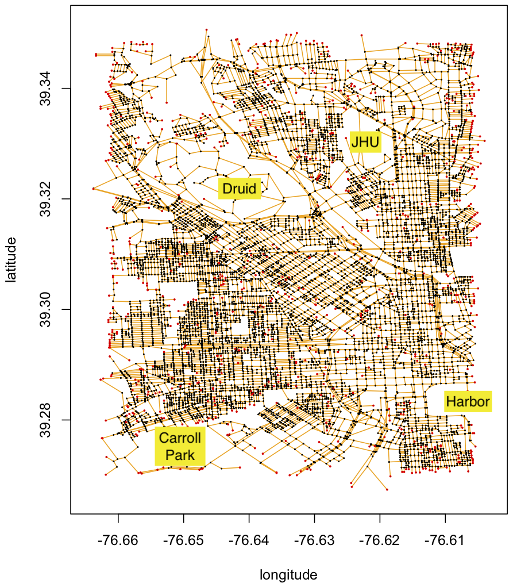
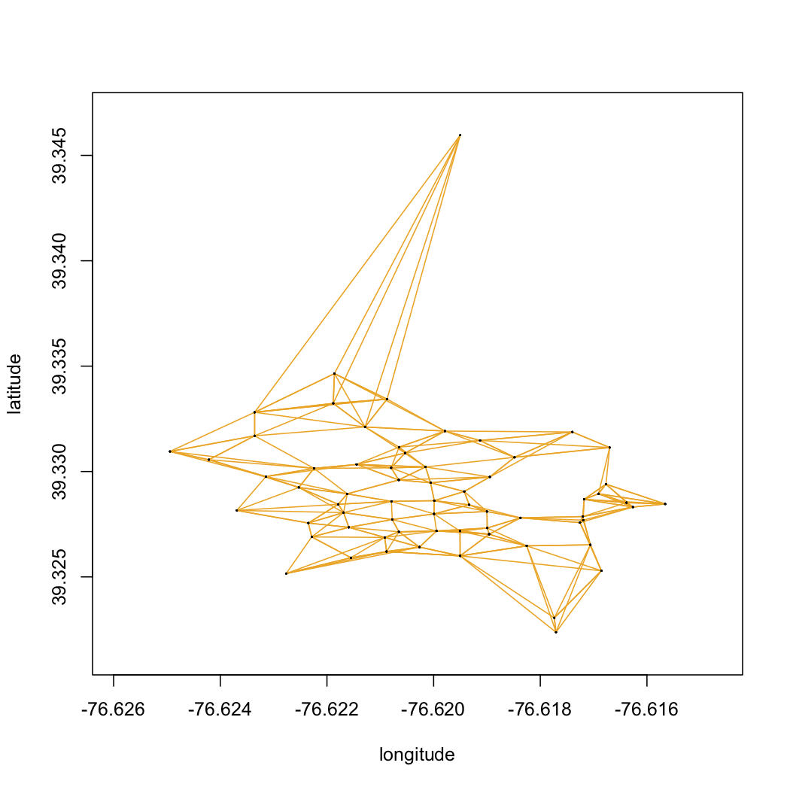

# Assignment 10: The Streets of Baltimore

- **Out on:** November 30, 2018
- **Due by:** December 7, 2018 before 10:00 pm
- **Collaboration:** None
- **Grading:**
  - Packaging 10%,
  - Style 10% (where applicable),
  - Testing 10% (where applicable),
  - Performance 10% (where applicable),
  - Functionality 60% (where applicable)

## Special Grading Announcement!

We have decided to make the tenth assignment optional. If you elect
to do the assignment it can be used to *replace* the grade from one
of your earlier assignments, so that we will only consider your 9
highest grades from all of the assignments. If you submit this assignment
but score worse than your previous nine assignments, this assignment
will be dropped. If you elect to skip the assignment, there will be no penalty, 
although we strongly encourage you to do so only if you have very good grades
for the other assignments. Also note that the concepts and implementation
issues that arise for this assignment are all valid questions for the final exam.

## Overview

The tenth assignment returns to our study of graphs, although this time
we are using a weighted graph rather than the unweighted movie/movie-star 
graph. Specifically, you will be touring the streets of Baltimore to find 
the shortest route from the JHU campus to other destinations around
Baltimore.

To solve this, we have provided for you a street map of Baltimore around
the JHU campus. The original data was provided by the 
[City of Baltimore](http://gis-baltimore.opendata.arcgis.com/datasets/street-centerline/data)
although we have focused it on a smaller region to make it more manageable. 
We have also simplified the formatting to make it easier to parse, although
the GPS coordinates and street names are real.

The street map data is available in the file `baltimore.streets.txt.gz`.
The first thing you will need to do is unpack it using the command
`gunzip baltimore.streets.txt.gz`. Here are the first few lines of the file:

```
-76.6254,39.3373 -76.6255,39.3373 21.5510 39256:W_UNIVERSITY_PKWY
-76.6443,39.3096 -76.6443,39.3099 133.363 1530:1800_BLK_N_WOODYEAR_ST
-76.6177,39.3293 -76.6175,39.3292 70.8768 38350:E_34TH_ST
-76.6457,39.3149 -76.6454,39.3151 120.759 41431:AVALON_AVE
-76.6568,39.3244 -76.6569,39.3243 44.6691 37858:WAHOTAN_AVE
-76.6071,39.3115 -76.6061,39.3116 285.046 31155:800_BLK_E_NORTH_AVE
```

Each line in the file defines a road segment. The first pair of numbers
represents the GPS coordinates (longitude and latitude) of the beginning
of the road segment, the second pair of numbers is end of the road segment,
the next number is the length of the road segment in meters, and the final
field is the name of the road segment. All of the road segments names start
with a unique integer index (the same index that is used on the City of Baltimore 
website), although not every road segment has an english name.

Notice that this is an edge-oriented representation of the street network graph:
nodes in the graph are intersections, and the edges represent the road segments
that connect the intersections. Some of the road segments form deadends, especially
alleys that dont connect to other roads. Note that while we are using GPS coordinates
to define the start and end of each road segment, you can treat them as strings!  
However, For reference, we have plotted the roadmap file here:



The orange lines represent the data in the baltimore.streets.txt file. The black
dots highlight intersections where two or more road segments come together. The
red dots highlight when a road segment does not intersect any other road segments. 
We have also highlighted a few landmarks (JHU, the Harbor, Druid Park, and Carroll 
Park) to orient you to the road map.

We have also provided a smaller file representing the walking paths of the
JHU campus called `campus.paths.txt.gz`. It follows the same formating as the larger street map, but can be 
useful for testing purposes.



## Problem 1: Street Graph Implementation (50%)

The first problem is to develop an efficient implementation for loading the street 
graph by filling in the missing functions in the StreetGraph.java file. Do not change
any of the signatures for the methods provided, since our testing framework will be calling
these methods directly, although you should add additional helper methods and/or helper 
classes. 

Unlike the Angelina graph problem, you can specialize the implementation just for
representing the street graph. As with the Angelina, you should strive
for an efficient implementation for inserting and searching for roads and 
intersections.  You are allowed to use the Java
collection classes `java.util.List`, `java.util.ArrayList`, 
`java.util.LinkedList`, and `java.util.HashMap` to simplify
your implementation.

As part of your `StringGraph` implementation, you will need **two**
private nested **or** inner classes, one to represent intersections (vertices), the
other to represent road segments (edges). You do not need to implement
an iterator. Note the road segment lengths will need to be stored with the edges.

### Testing

Your `StreetGraphTest` class should come with a full suite of
JUnit 4 test cases in a file `StreetGraphTest.java`.
Be sure to test **all** public methods and be sure to test **all**
exceptions for error situations as well. Feel free to use the `toString()`
method to aid in development and testing, but you do not need to test that
method. Refer to the Angelina assignment for details on visualizing graphs
using GraphViz.


## Problem 2: Dijkstra's algorithm implementation (40%)

The second problem is to implement Dijkstra's algorithm to find the shortest
path within a StreetGraph. To simplify the analysis,
you can assume that the graph search will start and end at the intersection
between different road segments, and not arbitrary GPS coordinates. And 
like the Angelina problem, your program can just print the path and total
distance to standard out before quiting.

To do so fill in the missing functions in the `SteetSearcher.java` file.
Be sure to not change any of the methods since our test code will be calling
these methods directly. You do not need to submit JUnit test code for
this file but accuracy will be very important to get Problem 3 correct! For
this part of the problem you are allowed to use `java.util.PriorityQueue`.

The output should print to standard out the total path distance followed
by the names of the roads taken. For example, when searching the 
campus map this would be the path from Malone Hall to the 
Undergraduate Teaching Labs.

```
$ java StreetSearcher campus.paths.txt -76.620883,39.326204 -76.620647,39.331158
Loading network from: campus.paths.txt
Loaded 330 roads
Loaded 65 endpoints
Total Distance: 599.0427883190066
Malone_Hall--Shriver_Hall 58.16225478578063
Shaffer_Hall--Shriver_Hall 89.26249532106544
Maryland_Hall--Shaffer_Hall 90.0868664408058
Maryland_Hall--Krieger_Hall 69.82039980173397
Remsen_Hall--Krieger_Hall 94.57560573433979
Remsen_Hall--Dunning_Hall 84.02193188902837
Undergraduate_Teaching_Labs--Dunning_Hall 113.11323434625268
```

If there is no path between the endpoints, your code should print:
```
No path found
```


## Problem 3: Touring around charm city (10%)

The final problem does not require implementing any new code, but will be to analyze
the run time and memory requirements to find the short path between different locations.
Specifically you should use `xtime` to record the running time and memory requirements
to search between these different locations:

```
  JHU to 7-11
  Starting location: -76.6175,39.3296
  Ending location: -76.6214,39.3212

  JHU to Druid Lake
  Starting location: -76.6175,39.3296
  Ending location: -76.6383,39.3206

  JHU to the Inner Harbor
  Starting location: -76.6175,39.3296
  Ending location: -76.6107,39.2866

```

In your README be sure to comment on how the memory and times varies for the different
queries -- the main question is *why* does it change when searching the exact same graph.
Make sure to also report the total length (in meters) between the locations, and the
names of the road segments used. If your program fails to find a path, please report this
as well, and explain why you think it did not find a path.


### Hint:

My strong advice is to start very small, even if that means creating a tiny graph with 4 or 5 road segments Then gradually work up to the larger ones as you become more sure things are working well. Then and only then should you try the full dataset. Note you may need to increase the RAM available to the virtual machine a bit - you can do this on the "System" tab of the Lubuntu Settings within the VirtualBox app


## Deliverables

Go to the assignment 10 page for Gradescope and click submit. Note that you can resubmit any time up until the deadline. You will be prompted to upload your files at which point you will upload all of the necessary source files. In the future we might not list them out, but for this assignment they are listed explicitly below:

```
  README
  StreetGraph.java
  StreetGraphTest.java
  StreetSearcher.java
```

**Note (especially for Java files) your files must be named exactly as we are expecting them for them to work in the autograder.**

Also note that for provided files (such as `Graph.java`), we will be dropping in the provided version with your solution. So if you change `Graph.java` and try to submit it, the original distributed `Graph.java` we have will overwrite it. It is important not to modify those given interface files.

After you submit, the autograder will run and you will get feedback on your functionality and how you performed on our test cases. For this assignment, we will not display all of the test cases we run in the autograder to you so you will not know exactly which test case failed. The test cases are what gets you the functionality points on the assignment. If for some reason your code did not compile, you should get that output from the autograder showing you the error messages it received. If you cannot figure out why your code is not working in the autograder, but works for you locally, post a private message on piazza.

Include a `README` file that explains what your programs do and
contains the written solutions and any other notes you want us to check out before grading. This is also a required file to upload.

**Finally, make sure to include your name and email address in every
file you turn in (well, in every file for which it makes sense to do so anyway)!**

## Grading

For reference, here is a short explanation of the grading criteria;
some of the criteria don't apply to all problems,
and not all of the criteria are used on all assignments.

**Packaging** refers to the proper organization of the stuff you hand in,
following both the guidelines for Deliverables above as well as the general
submission instructions for assignments.

**Style** refers to Java programming style, including things like consistent
indentation, appropriate identifier names, useful comments, suitable `javadoc`
documentation, etc.
Many aspects of this are enforced automatically by
[Checkstyle](http://checkstyle.sf.net/) when run with the configuration
file available on [github](https://github.com/schatzlab/datastructures2018/tree/master/resources).
Style also includes proper modularization of your code (into interfaces,
classes, methods, using `public`, `protected`, and `private` appropriately,
etc.).  Simple, clean, readable code is what you should be aiming for.

**Testing** refers to proper unit tests for all of the data structure classes
you developed for this assignment, using exceptions and assertions
as introduced in lecture. Make sure you test **all** (implied) axioms that you can think of and
**all** exception conditions that are relevant.

**Performance** refers to how fast/with how little memory your program can
produce the required results compared to other submissions.

**Functionality** refers to your programs being able to do what they should
according to the specification given above; if the specification is ambiguous
and you had to make a certain choice, defend that choice in your `README` file.

**If your programs cannot be built you will get no points whatsoever.
If your programs cannot be built without warnings using `javac -Xlint:all`
we will take off 10% (except if you document a very good reason; no, you
cannot use the `@SuppressWarnings` annotation either).
If your programs fail miserably even once, i.e. terminate with an exception of
any kind, we will take off 10% (however we'll also take those 10% off if you're
trying to be "excessively smart" by wrapping your whole program into a
universal try-catch).**
